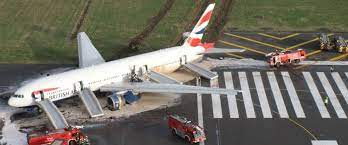
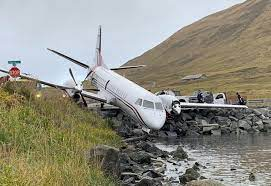
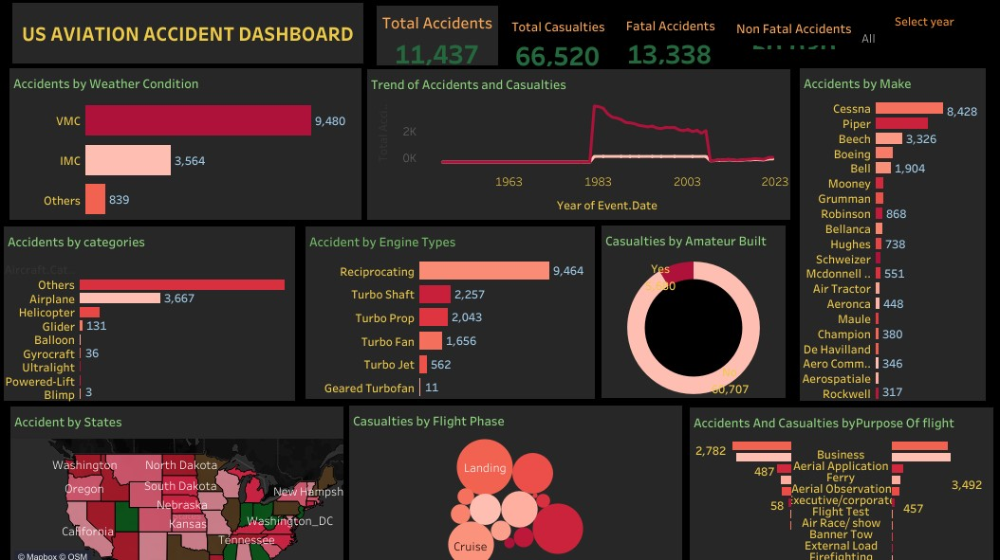

### US-AVIATION-ACCIDENTS

## Introduction

The US aviation industry is renowned for its innovation, technological advancements, and global reach. It encompasses major airlines like Delta, American, and United, as well as industry giants such as Boeing and Lockheed Martin. Additionally, there are numerous regional carriers, cargo operators, and general aviation services that make up this dynamic sector.  The aviation industry has revolutionized the way we connect with the world, providing us with unprecedented speed and convenience in travel. However, with this progress comes the sobering reality that accidents can and do occur. Aviation accidents are a subject of global concern, impacting the safety and security of passengers, crew members, and the communities surrounding airports. By delving into the complexities of aviation accidents, this portfolio seeks to foster a deeper understanding of the challenges and innovations within the aviation industry. It is our hope that this exploration will contribute to the ongoing efforts to make air travel safer for everyone involved and inspire a commitment to continuous improvement in aviation safety practices.

## Problem Statement

The Objectives of this analysis are as follow:

- Total Accidents.

- Total Casualities.

- Fatal Casualities.

- Non Fatal Casualities.

- Accidents by mark.

 

- ## Skills Demostrated

-   The following skills are demostrated

  - Excel for data profiling
    
  - Calculated field for KPIs
    
  - Silcers for filtering
    
  - Tableau for data visualization

- ## Data Sourcing
  

This datasets is from www.kaggle.com. it is a csv file with a single table. Its has 14 columns and 55349 rows.

- ## Data Modeling

These a single dataset therefore data modeling was not carried out.

- ## Data Analysis and Visualization
  
   [Click here to view US Aviation dashboard workbook](https://public.tableau.com/app/profile/ussy.page/viz/AviationAccident_16898150124380/USAviationDashboard)

- Total number of Accidents is 11,437 during the period covered.
 
- Total Casualities 66,520 and 13,338 for Fatal casualities.
  

